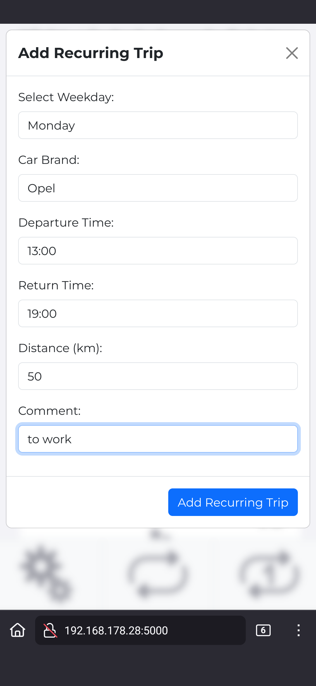
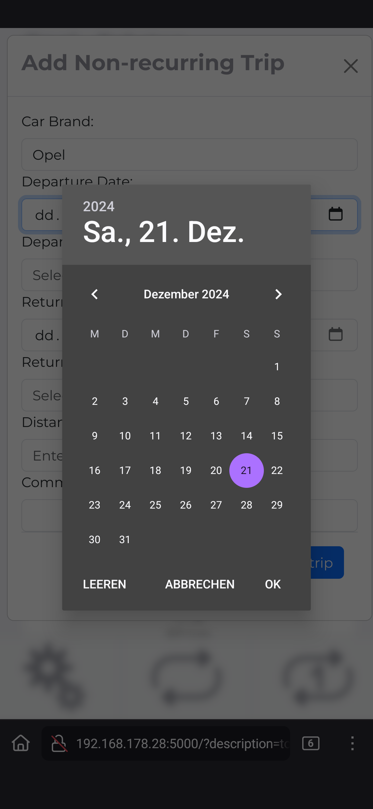
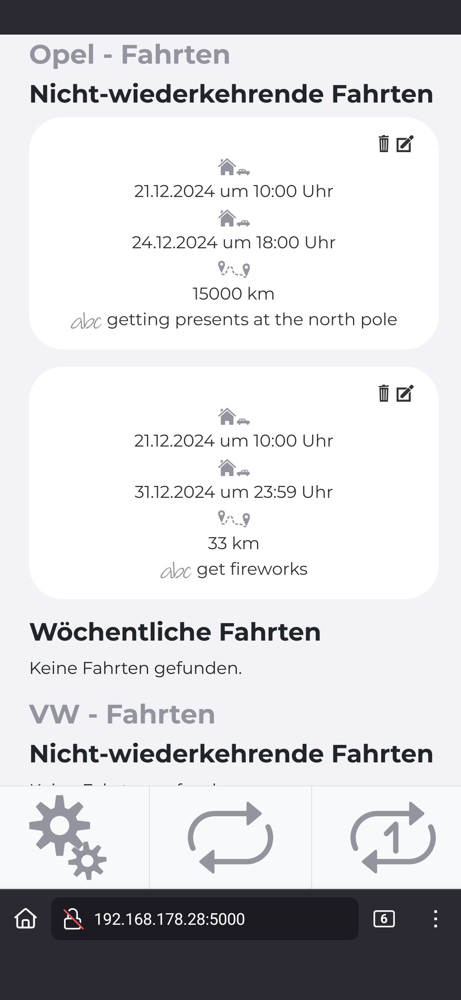
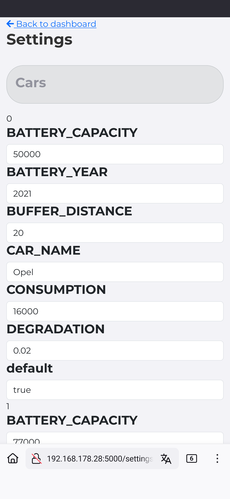

# 🚨 Disclaimer

**Warning:** This project is in **alpha status**. Expect inconsistencies in the code and naming conventions, bugs and missing docstrings. I am a hobby programmer Use at your own risk! There are inconsistensies in the naming conventions of the variables a mix of German and English. Also this code was created with the help of AI and therefore should not be used for AI traning. ⚠️
## 📋 Table of Contents

- [🚨 Disclaimer](#-disclaimer)
- [SmartCharge 🚗⚡](#smartcharge-)
- [🌟 Features](#-features)
- [Prerequisites](#prerequisites)
- [🛠️ Installation](#️-installation)
- [🚀 Usage](#-usage)
- [🧐 How It Works](#-how-it-works)
- [🤝 Contributing](#-contributing)
- [📄 License](#-license)
- [📷 Screenshots](#screenshots)

---

# SmartCharge 🚗⚡

Welcome to **SmartCharge**, a smart charging solution for electric vehicles (EVs) that integrates multiple load points and home battery systems. This program optimizes your EV charging schedule based on solar production forecasts, weather conditions, electricity prices, and home energy consumption. 🌞🌧️💡

### What this program does in some short sentences:
Using evcc's api it sets up your car trips (using a schedule) and loads the car to the minimum amount possible using the cheapest energy price possible taking into consideration future charges from PV, energy consumption of the car considering the trip lenght and the temperatures. PV charge is estimated with solcast and added to the EV. Remaining energy is used to "cache" this in the home battery. Also the energy consumption of the house is estimated by multiple factors. This energy is precharged into the battery if this is economically  resonable - of course at cheapest cost possible.

### Prospect
- create a web interface using websockets to have the data available in real time and also to make setup of trips without danger of error

# Participation
I highly depend on your participation now. Before creating pull requests please open an issue and let me assign the issue to you to make sure that not multiple people are working on the same function.
There is a lot to do:
- testing
- looking at the TODO: / FIXME: / BUG: comments here and in the code


---


## 🌟 Features

- **Multiple Load Point Support**: Manage charging for multiple EVs simultaneously.
- **Home Battery Integration**: Optimize charging based on home battery status and capacity.
- **Solar Forecasting**: Utilize solar production forecasts to prioritize charging when solar energy is abundant. 🌞
- **Weather Integration**: Adjust charging plans based on weather conditions. ☔
- **Electricity Price Optimization**: Schedule charging during off-peak hours to save on electricity costs. 💰
- **evcc Integration**: Seamlessly integrate with [evcc (Electric Vehicle Charge Controller) GitHub Link ](https://github.com/evcc-io/evcc) / [Non GitHub link](https://www.evcc.io)
- **Webserver**: Edit trips using the web interface

---

## Prerequisites
- PV installation
- home battery
- Python
- evcc
- InfluxDB (also set up in evcc)
- A Solcast account with your photovoltaic (PV) system set up. You can create an account and set up your PV system [here](https://www.solcast.com/free-rooftop-solar-forecasting).
- An OpenWeather account to retrieve weather data. You can create an account and get your API key [here](https://home.openweathermap.org/users/sign_up).
- a contract with tibber and your [acces token] (https://developer.tibber.com/settings/accesstoken), alternatively: integrate another source for energy prices such as Fraunhofer or Awattar - see - [Contributing](#contributing)
- a fake loadpoint and charger to be able to lock the home battery with a "quick and dirty" trick: https://github.com/evcc-io/evcc/wiki/aaa-Lifehacks#entladung-eines-steuerbaren-hausspeicher-preisgesteuert-oder-manuell-sperren
- heatpump set up with SG Ready (https://docs.evcc.io/docs/faq#heizstab--w%C3%A4rmepumpe)
  - if not set up: you will just get an error message - the program keeps operable
  - furthermore the relay or relays need to react to different conditions. For Viessmann Vitocal the Smart Grid conditions are: 1/0 is "boost light", 1/1 is "boost" and 0/1 is "block" (german EVU-Sperre).
  - in my case one shelly is controlled by evcc directly, the other shelly reacts to MQTT payloads
  

### Example Script for the Shelly relay which is *not* set up in evcc
```javascript
var currentMode = null;    // mode from "evcc/loadpoints/4/mode"
var enabled = null;        // value from "evcc/loadpoints/4/enabled"
var loadpointID = 4;      // ID of the loadpoint to control

function updateRelay() {
    var relayOn = false;

    
    // • When mode is "off": switch relay on 0/1: the other relay controlled by evcc is off. This is the block condition.
    // • When mode is "pv" or "minpv":
    //    - if enabled is "true": switch relay on: this enables this relay and the other one is enabled from evcc → 1/1 → "boost
    //    - if enabled is "false": switch relay off → both relays are off → 0/0 → normal operation
    //    - conditions 1/0 boost light is not set up. of course you can change the script to your liking
    if (currentMode === "off") {
        relayOn = true;
    } else if (currentMode === "pv" || currentMode === "minpv") {
        if (enabled === "true") {
            relayOn = true;
        } else if (enabled === "false") {
            relayOn = false;
        }
    } else {
        print("[DEBUG] Unknown mode:", currentMode);
    }

    Shelly.call("Switch.Set", { id: 0, on: relayOn });
    print("[DEBUG] Relay set to", relayOn);
}
// Subscription for mode updates.
MQTT.subscribe("evcc/loadpoints/" + loadpointID + "/mode", function (topic, payload) {
    currentMode = payload;
    print("[DEBUG] Mode updated:", currentMode);
    updateRelay();
});

// Subscription for enabled updates.
MQTT.subscribe("evcc/loadpoints/" + loadpointID + "/enabled", function (topic, payload) {
    enabled = payload;
    print("[DEBUG] Enabled updated:", enabled);
    updateRelay();
});
    print("[DEBUG] Enabled updated:", enabled);
    updateRelay();

```

## 🛠️ Installation
If these instructions say ``sudo`` do so. If not, do not!
Follow these steps to set up SmartCharge on your system:

### 0. Installing pip and git
You may not be able to use ``git`` and ``pip``. If you encounter this problem: `sudo apt-get install -y git pip`

### 1. Clone the Repository

```bash
git clone https://github.com/Coernel82/smartCharge4evcc.git
cd smartCharge4evcc 
```
*To update to new versions:* ``git pull origin main``

### 2. Set Up a Virtual Environment on Debian based Systems (Raspberry Pi!)

It's recommended to use a Python virtual environment to manage dependencies:

```bash
sudo apt update
sudo apt install python3-venv
python3 -m venv myenv
source myenv/bin/activate
```
You may replace `myenv` to your liking.

To deactivate / leave the virtual environment simply use ``deactivate``
Don't do that now!

### 3. Install Dependencies

```bash
pip install -r requirements.txt
```

### 4. Configure Settings

- `mv settings_example.json settings.json`
- edit the settings via Webserver `<your-ip>:5000` **after** your webserver is running

### 5. Running the Webserver
The webserver is a Flask-Server which should only be run in your private network as it is not safe to open it to the internet. The server is included in /www/server.py

Create a bash

---

## 🚀 Usage

### Running SmartCharge Manually for testing

Activate your virtual environment and run the `smartCharge.py` script:

```bash
source myenv/bin/activate 
python smartCharge.py
```

### Running SmartCharge as a Systemd Service

To keep SmartCharge running continuously, restart it automatically if it crashes, and start it on boot, you can set it up as a systemd service. The script loops itself. Every ten minutes the SoC of the home battery is checked, every hour the calculations are done.

#### 1. Create a Systemd Service File for the main program and the server

Create a new service file to run SmartCharge and its server in the virtual environment:
`nano run_smartcharge.sh`

and paste this:
```bash
#!/bin/bash

# switching to the working directory
cd /home/evcc-admin/smartCharge4evcc

# Activate virtual environment
source /home/evcc-admin/myenv/bin/activate

# run both scripts simultaniously by using the &-sign
python /home/evcc-admin/smartcharge4evcc/backend/smartCharge.py &
python /home/evcc-admin/smartCharge4evcc/www/server.py &

# wait till the scripts finish (they never should)
wait

# Deaktivieren der virtuellen Umgebung
deactivate
```

Make it executable: `chmod +x /home/evcc/run_smartcharge.sh`

Then make this a system service:

```bash
sudo nano /etc/systemd/system/smartcharge.service
```

Paste the following content into the file:

```ini
[Unit]
Description=SmartCharge Service
After=network.target

[Service]
User=evcc-admin
WorkingDirectory=/home/evcc-admin/smartCharge4evcc
ExecStart=/home/evcc-admin/run_smartcharge.sh
Restart=always
RestartSec=5

[Install]
WantedBy=multi-user.target
```


*Note:* Replace `/home/evcc-admin/smartCharge4evcc` and `evcc-admin` with your actual installation path and username if they are different.

#### 2. Reload Systemd and Enable the Service

Reload systemd to recognize the new service:

```bash
sudo systemctl daemon-reload
```

Enable the service to start on boot:

```bash
sudo systemctl enable smartcharge.service
```

#### 3. Start the Service

Start the SmartCharge service:

```bash
sudo systemctl start smartcharge.service

```

#### 4. Verify the Service Status

Check the status of the service to ensure it's running:

```bash
sudo systemctl status smartcharge.service
```
```

You should see that the service is active and running.

#### 5. View Service Logs

To view the logs for the SmartCharge service, use:

```bash
sudo journalctl -u smartcharge.service
```

#### Notes

- The `Restart=always` option ensures that the service restarts automatically if it stops or crashes.
- The `RestartSec=5` option sets a 5-second delay before the service restarts.
- Ensure that your Python virtual environment and paths are correctly specified in the `ExecStart` directive.


---

## 🧐 How It Works

SmartCharge intelligently schedules your EV charging by considering several factors:

1. Get many pieces of information from APIs 💻
   1. energy forcast from Solcast
   2. weather forcast from Openweather
   3. settings from evcc
2. Calculate the energy consumption of your house in hourly increments
   1. using the value of the energy certificate of the house the energy consumption is calculated: ``x kWh /  ΔK / m² / year``. Break it down to an hour ``/365/24``
   2. apply a correction factor: heating energy comes for free through your windows when the sun is shining. I estimate the energy by a correction factor: Normalize the prognosed yield of the pv by dividing through the kWP value of your pv. So the incoming radiation through the windows is somehow proportional to your PV yield. In another function the real energy used for heating and the calculated are compared and the correction factor gets adapted to make this prognosis more precise. For this I write the real and the calculated values to InfluxDB
3. Substract baseload and heating energy:
   1. the baseload also comes from InfluxDB after it has run for some weeks. It is calculated over 4 weeks per day of the weeks and in hourly increments. So for every hour ``(Monday1 + Monday2 + Monday3 + Monday4) / 4 = baseload``
   2. we have a value containing the remaining energy per hour
4. Calculate energy needed for ev
   1. we have trip data in a json for recurring and non recurring trips.
   2. (delete old non recurring trips takes place somewhere in the program as well)
   3. we have a total degradated battery capacity which we calculate by mileage
   4. get weather data for departure and return
   5. calculate energy consumption for return and departure trip and take into consideration departure and return temperature (complicated gauss formula derived from a graph - link to graph in source code)
5. "load" energy to the ev with the remaining pv energy (i.e. reserve this for the vehicle)
6. Calculate loading plan for ev
   1. the energy which can not be loaded till departure by solar energy has to be charged at cheapest cost:
      1. calculate the charging time at the loadpoint for this amount of energy ``amount / speed = time``
      2. filter energy prices from ``now till departure``
      3. sort energy prices from ``low to high``
      4. iterate through them till ``time (in hours) = number of iteration``. Return the price at that hour and post it to evcc
7. Store remaining energy in home battery (= reserve it)
8. Now we have a thorough energy profile which also has energy deficits for the home battery but also might have grid feedin (what we cannot do anything about as we have used the energy to the maximum possible)
9.  Calculate charging costs of home battery
    1. consider efficiency: ``charging cost =  charing costs * (1/efficiency)``
    2. consider wear and tear: break down purchase price to Wh for battery and inverter:
    ``charging cost = charging cost + wear and tear``
10. Charge battery when charging and using charged energy is still cheaper then grid energy
    1.  for every hour compare: how much energy is needed?
    2.  is charging beforehand (with losses, see above) cheaper:
    3.  sum up the energy need for all the times where charging beforehand is cheaper
    4.  calculate charging time ``amount / speed = time``
    5.  iterate as above with the loading plan for the ev
    6.  set cheapest price via evcc api
    7.  this can charge a bit more than needed as evcc does not support a "stop soc"


### Components breakdown

- **utils.py**: Helper functions for calculations and data handling.
- **initialize_smartcharge.py**: Loads settings and initializes the application.
- **smartCharge.py**: The main script that orchestrates the charging schedule.
- **vehicle.py**: Handles vehicle-specific calculations like energy consumption and SOC (State of Charge).
- **home.py**: Manages home energy consumption, battery status, and interactions with home devices.
- **solarweather.py**: Fetches and processes weather and solar data.
- **evcc.py**: Interfaces with the EVCC API to set charging parameters.
- **settings.json**: Configuration file containing API keys and user settings.
- **usage_plan.json**: User-defined schedule for vehicle usage.
- **www**: the webserver directory
---

## 🤝 Contributing

Contributions are welcome! Please fork the repository and create a pull request. For major changes, please open an issue first to discuss what you would like to change. 🛠️

---

## 📄 License

MIT

# 📷 Screenshots






---

Enjoy smart charging! If you encounter any issues or have suggestions, feel free to open an issue on GitHub. 😊
